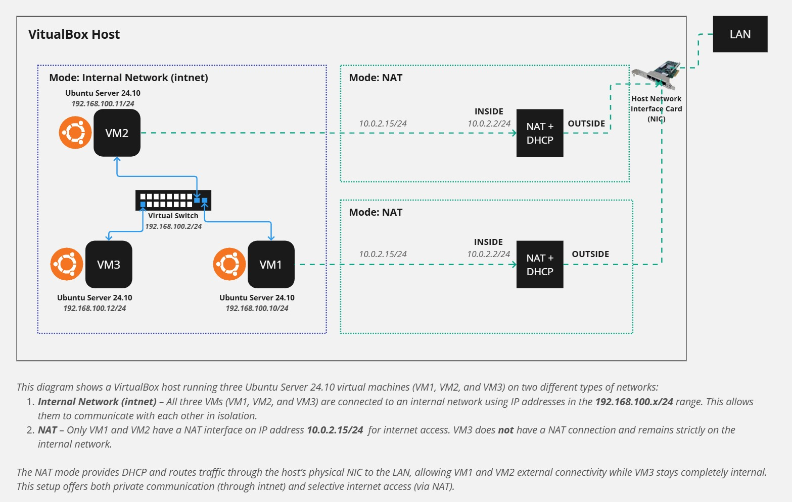

# CSL7510: Virtualization and Cloud Computing  
### Assignment 1: Use VirtualBox to Create Multiple VMs, Connect These VMs, and Host One Microservice-Based Application  

---

## Objective  
Create and configure multiple Virtual Machines (VMs) using VirtualBox, establish a network between them, and deploy a microservice-based application across connected VMs.

---

## 1. Creation of Virtual Machines on VirtualBox

### Prerequisites  
- Download and install [VirtualBox](https://www.virtualbox.org/).  
- Obtain an OS image (e.g., Ubuntu ISO) for VM installation. [Link](https://ubuntu.com/download/server)  

### Steps to Create Virtual Machines  
1. Open VirtualBox and click **New**.  
2. Provide a name (e.g., `VM1`), select the ISO image, and select the OS type.  
3. Change username and password (if required).  
4. Allocate resources (RAM: 2GB-4GB recommended, CPU: 4 recommended).  
5. Create a virtual hard disk (VDI format, dynamically allocated, 5GB-8GB recommended).  
6. Repeat the above steps to create additional VMs (e.g., `VM2`, `VM3`).  

---

## 2. Configuration of Network Settings  
After installing the Guest OS in the VM, stop the VM and go to the network settings.  

### A. To enable Internet connection in VMs:  
1. Go to **Settings > Network** for each VM.  
2. Choose **NAT** to allow Internet connection.  
3. Ensure the **Cable Connected** checkbox is selected.  

### B. To enable communication between VMs:  
1. Go to **Settings > Network** for each VM.  
2. Choose **Internal Network** as another adapter.  
3. Use the same name for all VMs (e.g., `intnet`).  
4. Choose Promiscuous Mode as `Allow VMs` or `Allow All`.  
5. Ensure the **Cable Connected** checkbox is selected.  

### C. Assign static IPs to VMs:  
In Ubuntu, open terminal and follow these steps:  
- Start both VMs.  
- Check Network Interfaces:  
    ```bash
    ip a
    ```
- Configure Static IPs for Internal Network:  
    - For VM1:  
    ```yaml
    network:
      version: 2
      ethernets:
        enp0s3:
          dhcp4: true
        enp0s8:
          dhcp4: no
          addresses:
            - 192.168.100.10/24
    ```
    - For VM2:  
    ```yaml
    network:
      version: 2
      ethernets:
        enp0s3:
          dhcp4: true
        enp0s8:
          dhcp4: no
          addresses:
            - 192.168.100.11/24
    ```
    - Save the yaml file and apply changes:
    ```bash
    sudo netplan apply
    ```

### D. Test Connectivity:  
- From VM1, ping VM2:  
    ```bash
    ping 192.168.100.11
    ```
- From VM2, ping VM1:  
    ```bash
    ping 192.168.100.10
    ```
- Test Internet Access:  
    ```bash
    ping google.com
    ```

### Troubleshooting Tips:  
- Ensure both VMs have the same Internal Network name.  
- If pings aren't working, disable the firewall temporarily:  
    ```bash
    sudo ufw disable
    ```

---

## 3. Creating a Simple Flask Microservice  
1. On your Local Machine (Host OS), create a project folder.  
2. Install Flask:  
    ```bash
    pip install Flask
    ```
3. Create the Project Structure:  
    ```
    multi-vm-microservice-setup/
    ├── app.py
    └── requirements.txt
    ```

---

## 4. Push the Code to GitHub  
1. Initialize the repository:  
    ```bash
    git init
    ```
2. Add all files to staging:  
    ```bash
    git add .
    ```
3. Commit the changes:  
    ```bash
    git commit -m "Initial Flask microservice"
    ```
4. Link to Your GitHub Repo:  
    ```bash
    git remote add origin https://github.com/anushkaa-ambuj/multi-vm-microservice-setup.git
    ```
5. Push to GitHub:  
    ```bash
    git push -u origin main
    ```

---

## 5. Deployment of a Microservice Application  

### Installing Dependencies  
On VM1 (backend), install required packages:  
```bash
sudo apt update
sudo apt install git python3 python3-pip python3-venv -y
```

### Clone and Run on VM1 (Backend)

1. **Navigate to Home Directory**  
    ```bash
    cd ~
    ```

2. **Clone the Repository:**  
    ```bash
    git clone https://github.com/anushkaa-ambuj/multi-vm-microservice-setup.git
    cd multi-vm-microservice-setup
    ```

3. **Use Virtual Environment (Recommended)**  
    - **Create and Activate Virtual Environment**  
        ```bash
        python3 -m venv venv
        source venv/bin/activate
        ```

    - **Install Requirements inside VM1**  
        ```bash
        pip install -r requirements.txt
        ```

4. **Start the Application**  
    ```bash
    python3 app.py
    ```
    You should see:  
    ```
    * Running on http://0.0.0.0:5000 (Press CTRL+C to quit)
    ```

5. **Allow Traffic on Port 5000 (if required)**  
    ```bash
    sudo ufw allow 5000/tcp
    ```

---

### Step 5: Test the Microservice

1. **From VM1 (Backend)**  
    - **GET All Tasks**  
        ```bash
        curl http://localhost:5000/api/tasks
        ```

    - **POST New Task**  
        ```bash
        curl -X POST -H "Content-Type: application/json" \
        -d '{"title": "New Task"}' \
        http://localhost:5000/api/tasks
        ```

    - **PUT Update Task (e.g., Task with ID 1)**  
        ```bash
        curl -X PUT -H "Content-Type: application/json" \
        -d '{"title": "Updated Task", "completed": true}' \
        http://localhost:5000/api/tasks/1
        ```

    - **DELETE Task (e.g., Task with ID 1)**  
        ```bash
        curl -X DELETE http://localhost:5000/api/tasks/1
        ```

2. **From VM2 (Client)**  
    Use the IP of VM1 (`192.168.100.10`):

    - **GET All Tasks**  
        ```bash
        curl http://192.168.100.10:5000/api/tasks
        ```

    - **POST New Task**  
        ```bash
        curl -X POST -H "Content-Type: application/json" \
        -d '{"title": "New Task from VM2"}' \
        http://192.168.100.10:5000/api/tasks
        ```

    - **PUT Update Task (e.g., Task with ID 1)**  
        ```bash
        curl -X PUT -H "Content-Type: application/json" \
        -d '{"title": "Updated Task from VM2", "completed": true}' \
        http://192.168.100.10:5000/api/tasks/1
        ```

    - **DELETE Task (e.g., Task with ID 1)**  
        ```bash
        curl -X DELETE http://192.168.100.10:5000/api/tasks/1
        ```

3. **Alternatively, Open a Browser on the Host Machine**  
    Navigate to:  
    ```
    http://192.168.100.10:5000/api/tasks
    ```
    *(Note: Replace with the correct IP and port.)*

---

## Architecture Design  


---

## Source Code Repository  
- GitHub repository: [multi-vm-microservice-setup](https://github.com/anushkaa-ambuj/multi-vm-microservice-setup)

---

## Recorded Video Demo  
- Link: [Video Demo]()

---

## References  
- [Chapter 6. Virtual Networking | Oracle VirtualBox](https://www.virtualbox.org/manual/ch06.html)  
- [How VirtualBox 7.0 networking works](https://www.youtube.com/watch?v=Fhdxk4bmJCs)

